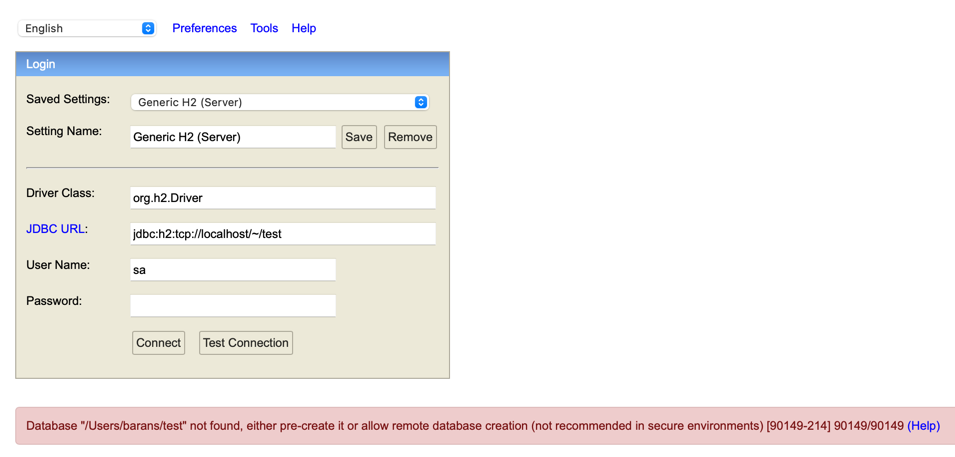

# Frequently Asked Questions

If an error occurs like "Database '/Users/barans/test' not found, either pre-create it or allow remote database creation (not recommended in secure environments) [90149-214] 90149/90149",A file named 'test.mv.db' should be created in the directory mentioned in the error.

The file named 'test.mv.db' under this directory can be used for this operation.